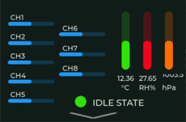
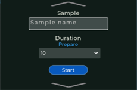
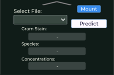

# ESP32-S3 Enose Sensor Data Acquisition and Display
This project is designed for the ESP32-S3 microcontroller, utilizing I2C communication to interface with multiple sensors and displaying real-time data on an LCD screen using LVGL.

For the NCKU WTMH Lab's E-nose device mobilization development project 
(original project reference: https://github.com/JimLin0406/E-nose-GUI-MEMS-version/tree/main)

## Graphic User Interface
Used "NXP GUI Guider" to design the framework of UI.

    


## Project Progress and Pending Tasks
- [x] **I2C Device Initialization & Configuration:**
  - Successfully initialized HS4011, BME280, PCA9547, and MEMS I2C sensors.
  - Configured working modes and parameters for each I2C device.
- [x] **Data Reading & Processing:**
  - Calculated and processed humidity, temperature, pressure data, and resistant.
- [x] **LVGL Display Setup:**
  - Set up ~~CST816S~~ ft6336u touchscreen and integrated it with LVGL for touch interaction.
- [x] **FreeRTOS Task Management:**
  - Created multiple tasks for I2C data reading, UI updates, and data processing.
  - Distribute task into two core on esp32-s3.
  - Used a queue to manage the transmission and updating of sensor data.
- [x] **Data Saving Function:**
  - Saving file via MSC (Mass Storage Class).
  - Using micro sd card as MSC.
- [x] **Design the Analysis Page:**
  - Implement analyais function via embeded qunatized MTL model.
- [x] **Hardware modification:**
  - Power manage design (via battery).
  - Shell of device.
  - Extra pumps and valves for inhaling/ exhaling target sample.

## Requirements
### Hardware
- ESP32-S3 LCD ESP32-S3-Touch-LCD-1.28
  - ESP32-S3 development board
  - ST7796 TFT-LCD
  - FT6336U touch controller module
- Taiyo Enose (MEMS with I2C slaves)
  - Temperature /Humidity sensor (HS4011)
  - Pressure sensor (BME280)
  - Multiplexer (PCA9547BS)
  - E-nose sensor*8
 
### Sofrware
#### VS code IDE
  - ESP32-IDF (version 5.3.2)
    
#### Software Configuration
Ensure that your sdkconfig has the necessary drivers enabled.
```
#dependencies
  lvgl/lvgl: ^8.3.10
  espressif/esp_lcd_st7796: ==1.0.0
  espressif/esp_lcd_touch: ^1.1.2
  espressif/esp-dl: =3.0.0
  espressif/esp_tinyusb: ^1.7.2
```

## Implementation
### 若要修改UI內容
1. 請使用NXP GUI Guider打開UI file
2. 修改完成後，按下Sinmulator按鈕:arrow_forward:，並選擇C code，以生成 ui c-code file
3. 自動生成的 ui c-code file會自動存至project_path/generated資料夾中
4. 複製所需.C/.H file至ESP-IDF_project_path/main/ui中，以覆蓋舊的ui c-code file


